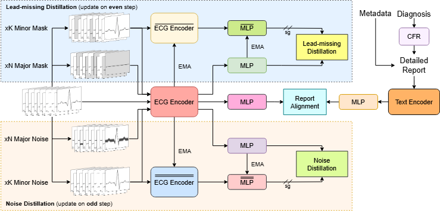

# [ACMMM 2025] TolerantECG: A Foundation Model for Imperfect Electrocardiogram

This repository contains the source code of paper **[TolerantECG: A Foundation Model for Imperfect Electrocardiogram](https://arxiv.org/abs/2507.09887)**


## Data preprocessing
The data used in this work can be downloaded using the links below:
- MIMIC-IV-IV: https://physionet.org/content/mimic-iv-ecg/1.0/
- MIMIC-IV-ECG-Ext-ICD: https://physionet.org/content/mimic-iv-ecg-ext-icd-labels/1.0.1/
- MIT-BIH: https://www.physionet.org/content/mitdb/1.0.0/
- MIT-BIH Noise Stress Test: https://www.physionet.org/content/nstdb/1.0.0/
- PTB-XL: https://physionet.org/content/ptb-xl/1.0.3/

After downloading, please put them in the `data` folder as such:

```
data
└───mimic-iv-ecg
|   |   machine_measurements.csv
│   |   record_list.csv
│   └───files
│       ...
└───mit-bih
|   │   100.atr
|   │   100.dat
│       ...
└───mit-noise
|   │   bw.dat
|   │   em.dat
|   │   ma.dat
│       ...
└───ptb-xl
|   │   pltxl_database.csv
|   │   scp_statements.csv
│   └───records500
│       ...
```

## Installation requirement

The necessary requirements can be installed using pip:
```bash
pip install -r requirements.txt
```

## Create CFR database
```bash
python -m src.init_cfr
```

## Training & fintuning
The training scripts are provided in the `script` folder. Or it can be simply run as  followed:
- Pretraining with MIMIC-IV-ECG:
```bash
./script/train.sh
```
- Finetune with PTB-XL Super-diagnosis:
```bash
./script/finetune.sh
```
Please note to change some of the arguments in the `.sh` files for desire modification.